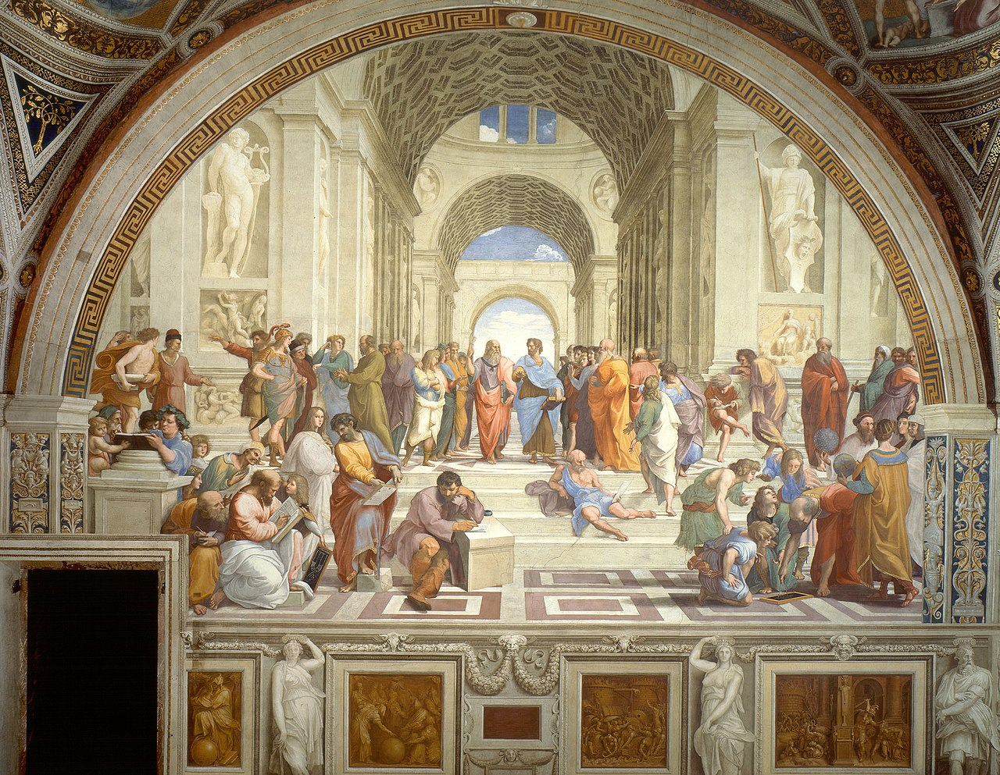

# yinwang bak

Articles from [yinwang.org](http://yinwang.org)

Forked from [Kuri-su/yinwang.bak](https://github.com/Kuri-su/yinwang.bak)

> Auto sync by [@Suzuha](https://github.com/Kurisu-A)  
> Project from [kurisu project](https://kuricat.com/project)

## 当然我在扯淡 - 目录

- 2020年06月10日 - 新丑陋的中国人
- 2020年05月23日 - 几个需要避免的美国英语习惯
- 2020年04月30日 - 一对一教学计划
- 2020年03月26日 - 计算机科学入门班报名
- 2020年03月23日 - 对智商的怀疑
- 2020年03月06日 - 英语学习的一些经验
- 2020年03月05日 - 知识星球试运营
- 2020年03月03日 - 计算机科学课程
- 2020年02月17日 - 谈职场中的命令口气
- 2020年02月13日 - 一道 Java 面试题
- 2020年02月05日 - 如何阅读别人的代码
- 2020年01月17日 - 顾问业务试运营（v2.0）
- 2020年01月16日 - 我的事业计划
- 2020年01月15日 - 未来的事业
- 2019年12月31日 - 2020新年寄语
- 2019年12月26日 - 所谓“成功”
- 2019年12月24日 - 我不是编译器专家
- 2019年12月23日 - 抱怨与观察的差别
- 2019年12月15日 - 自动化服务的误区
- 2019年11月05日 - 永恒
- 2019年10月24日 - 写在 1024 程序员节
- 2019年10月17日 - 免费食物不是好事
- 2019年09月30日 - 自动驾驶车的责任和风险分析
- 2019年09月16日 - 机器与人类视觉能力的差距（3）
- 2019年09月15日 - 机器与人类视觉能力的差距（2）
- 2019年09月14日 - 机器与人类视觉能力的差距（1）
- 2019年09月11日 - Talk is not cheap
- 2019年08月19日 - 关于微内核的对话
- 2019年08月17日 - 中国人的信任危机
- 2019年07月31日 - 关于人的素质
- 2019年07月21日 - 再谈“P vs NP”问题
- 2019年07月12日 - 学习的智慧
- 2018年11月23日 - 解谜英语语法
- 2018年04月13日 - 解谜计算机科学
- 2018年03月27日 - 扶门的礼仪
- 2018年03月08日 - 从苹果产品的设计错误学教训
- 2018年02月22日 - 智能合约和形式验证
- 2017年11月09日 - iPhone X
- 2017年11月05日 - 网络用语
- 2017年11月01日 - 理性的力量
- 2017年10月16日 - 人体工学
- 2017年08月19日 - 知乎和 MITBBS
- 2017年08月14日 - 旅行的智慧
- 2017年07月08日 - 生活的智慧
- 2017年07月06日 - 如何掌握所有的程序语言
- 2017年07月06日 - 带猫回国经历
- 2017年05月25日 - DSL 的误区
- 2017年05月23日 - Kotlin 和 Checked Exception
- 2017年05月17日 - 什么是现实理想主义者
- 2017年05月08日 - 美国企业的装嫩问题
- 2017年04月23日 - 人工智能的局限性
- 2017年04月17日 - 美国公司管理层的洗脑技巧
- 2017年04月14日 - 经验和洞察力
- 2016年10月13日 - C# 的 IDisposable 接口
- 2016年10月12日 - C 编译器优化的 Bug
- 2016年09月18日 - 对 Rust 语言的分析
- 2016年09月14日 - 测试的道理
- 2016年07月10日 - Tesla autopilot 引起致命车祸
- 2016年06月28日 - 养生节目的危害
- 2016年06月14日 - 美国社会的信息不平等现象
- 2016年06月08日 - Java 有值类型吗？
- 2016年06月06日 - Swift 语言的设计错误
- 2016年05月22日 - 正面思维的误区
- 2016年04月13日 - 博文的自愿付费方式
- 2016年03月31日 - 我为什么不再做 PL 人
- 2016年03月19日 - 为什么自动车完全不可以犯错误
- 2016年03月09日 - AlphaGo与人工智能
- 2016年02月12日 - 我看自动驾驶技术
- 2016年01月18日 - 给Java说句公道话
- 2016年01月10日 - Tesla Autopilot
- 2015年12月21日 - Tesla Model X的车门设计问题
- 2015年12月12日 - Tesla Model S 的设计失误
- 2015年11月21日 - 编程的智慧
- 2015年10月18日 - 图灵的光环
- 2015年09月19日 - 对 Parser 的误解
- 2015年07月04日 - 数学和编程
- 2015年07月02日 - 谈程序的正确性
- 2015年06月14日 - DRY原则的误区
- 2015年06月07日 - 所谓软件工程
- 2015年04月03日 - 编程的宗派
- 2015年03月21日 - 英语口音
- 2015年03月20日 - 智商的圈套
- 2015年03月20日 - 为什么拍照是个坏习惯
- 2015年03月17日 - 设计的重要性
- 2015年03月11日 - 关于Git的礼节
- 2015年03月03日 - 怎样尊重一个程序员
- 2015年02月24日 - 所谓“人为错误”
- 2015年02月20日 - 其他人的BUG
- 2015年02月01日 - 创造者的思维方式
- 2015年01月19日 - 小费和中国人的尊严
- 2015年01月05日 - 牛校综合征
- 2014年11月12日 - 恶评《星际穿越》
- 2014年09月15日 - 谈创新
- 2014年08月15日 - 贡献和价值
- 2014年08月14日 - 谦虚不是一种美德
- 2014年04月24日 - 关系式模型的实质
- 2014年04月18日 - 对 Go 语言的综合评价
- [ ] 2014年04月11日 - [黑客文化的精髓](articles/2014/黑客文化的精髓.md)
- [x] 2014年04月10日 - [电视编剧的问题](articles/2014/电视编剧的问题.md)
- [x] 2014年03月24日 - [学术腐败是历史的必然](articles/2014/学术腐败是历史的必然.md)
- [x] 2014年02月18日 - [一个对 Dijkstra 的采访视频](articles/2014/一个对%20Dijkstra%20的采访视频.md)
- [x] 2014年02月15日 - [我的第一次和最后一次 Hackathon 经历](articles/2014/我的第一次和最后一次%20Hackathon%20经历.md)
- [x] 2014年02月09日 - [程序员的心理疾病](articles/2014/程序员的心理疾病.md)
- [x] 2014年02月04日 - [程序语言与它们的工具](articles/2014/程序语言与它们的工具.md)
- [x] 2014年01月28日 - [RubySonar：一个 Ruby 静态分析器](articles/2014/RubySonar：一个%20Ruby%20静态分析器.md)
- [x] 2014年01月25日 - [程序语言与……](articles/2014/程序语言与…….md)
- [x] 2014年01月04日 - [我和权威的故事](articles/2014/我和权威的故事.md)
- [x] 2013年11月25日 - [PySonar2 与 Sourcegraph 集成完毕](articles/2013/PySonar2%20与%20Sourcegraph%20集成完毕.md)
- [x] 2013年07月13日 - [丘奇和图灵](articles/2013/丘奇和图灵.md)
- [x] 2013年07月06日 - [Pydiff Python结构化程序比较工具](articles/2013/PyDiff%20-%20Python%20结构化程序比较工具.md)
- [x] 2013年06月19日 - [我离开了 Coverity](articles/2013/我离开了%20Coverity.md)
- [x] 2013年04月26日 - [原因与证明](articles/2013/原因与证明.md)
- [x] 2013年04月21日 - [Ydiff 结构化的程序比较](articles/2013/ydiff%20-%20结构化的程序比较.md)
- [x] 2013年04月21日 - [程序语言不是工具](articles/2013/程序语言不是工具.md)
- [x] 2013年04月20日 - [编辑器与IDE](articles/2013/编辑器与IDE.md)
- [x] 2013年04月18日 - [程序语言的常见设计错误(2) - 试图容纳世界](articles/2013/程序语言的常见设计错误(2)%20-%20试图容纳世界.md)
- [x] 2013年04月17日 - [关于语言的思考](articles/2013/关于语言的思考.md)
- [x] 2013年04月16日 - [Yoda 表示法错在哪里](articles/2013/Yoda%20表示法错在哪里.md)
- [x] 2013年04月15日 - [几个超炫的专业词汇](articles/2013/几个超炫的专业词汇.md)
- [x] 2013年04月14日 - [标准化试卷标记语言](articles/2013/标准化试卷标记语言.md)
- [x] 2013年04月14日 - [一种新的操作系统设计](articles/2013/一种新的操作系统设计.md)
- [x] 2013年04月14日 - [Markdown 的一些问题](articles/2013/Markdown%20的一些问题.md)
- [x] 2013年04月14日 - [论“我”和“我们”](articles/2013/论“我”和“我们”.md)
- [x] 2013年04月13日 - [谈程序的“通用性”](articles/2013/谈程序的“通用性”.md)
- [x] 2013年04月12日 - [什么是启发](articles/2013/什么是启发.md)
- [x] 2013年04月11日 - [Scheme 编程环境的设置](articles/2013/Scheme%20编程环境的设置.md)
- [x] 2013年04月10日 - [我为什么离开 Cornell](articles/2013/我为什么离开%20Cornell.md)
- [x] 2013年04月07日 - [测试驱动开发](articles/2013/测试驱动开发.md)
- [x] 2013年04月03日 - [爱因斯坦谈教育](articles/2013/爱因斯坦谈教育.md)
- [x] 2013年04月02日 - [Currying 的局限性](articles/2013/Currying%20的局限性.md)
- [x] 2013年04月01日 - [惰性求值](articles/2013/惰性求值.md)
- [x] 2013年03月31日 - [函数式语言的宗教](articles/2013/函数式语言的宗教.md)
- [x] 2013年03月29日 - [什么是“脚本语言”](articles/2013/什么是“脚本语言”.md)
- [x] 2013年03月28日 - [Chez Scheme 的传说](articles/2013/Chez%20Scheme%20的传说.md)
- [x] 2013年03月26日 - [Lisp 已死，Lisp 万岁！](articles/2013/Lisp%20已死，Lisp%20万岁！.md)
- [x] 2013年03月24日 - [论对东西的崇拜](articles/2013/论对东西的崇拜.md)
- [x] 2013年03月19日 - [“解决问题”与“消灭问题”](articles/2013/“解决问题”与“消灭问题”.md)
- [x] 2013年03月15日 - [程序语言的常见设计错误(1) - 片面追求短小](articles/2013/程序语言的常见设计错误(1)%20-%20片面追求短小.md)
- [x] 2013年03月08日 - [谈语法](articles/2013/谈语法.md)
- [x] 2013年03月07日 - [Oberon 操作系统：被忽略的珍宝](articles/2013/Oberon%20操作系统：被忽略的珍宝.md)
- [x] 2013年03月07日 - [谈 Linux，Windows 和 Mac](articles/2013/谈%20Linux，Windows%20和%20Mac.md)
- [x] 2013年03月07日 - [解密“设计模式”](articles/2013/解密“设计模式”.md)
- [x] 2013年03月04日 - [Braid - 一个发人深思的游戏](articles/2013/Braid%20-%20一个发人深思的游戏.md)
- [x] 2012年09月18日 - [TeXmacs：一个真正“所见即所得”的排版系统](articles/2012/TeXmacs：一个真正“所见即所得”的排版系统.md)
- [x] 2012年08月01日 - [怎样写一个解释器](articles/2012/怎样写一个解释器.md)
- [x] 2012年07月25日 - [什么是语义学](articles/2012/什么是语义学.md)
- [x] 2012年07月04日 - [GTF - Great Teacher Friedman](articles/2012/GTF%20-%20Great%20Teacher%20Friedman.md)
- [x] 2012年05月18日 - [什么是“对用户友好”](articles/2012/什么是“对用户友好”.md)
